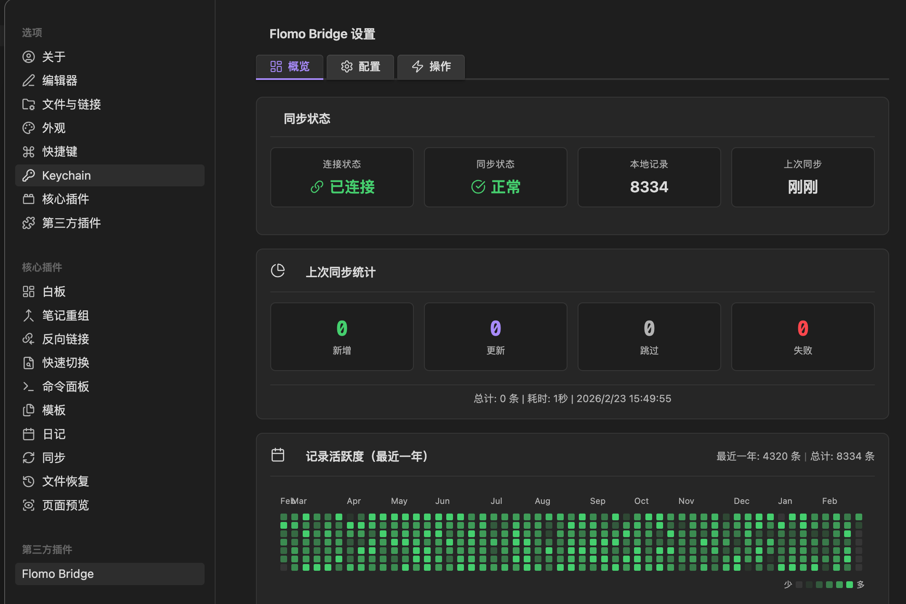

# Flomo Bridge

将 [flomo](https://flomoapp.com/) 笔记桥接到 Obsidian 的插件。

## 最新版本

- `1.0.1`
- 发布包解压后的目录名固定为 `flomo-bridge`（不包含版本号）

## 功能特性

- ✅ **增量同步** - 只同步新增/修改的笔记，避免重复写入
- ✅ **全量同步** - 支持重置游标重新同步所有笔记
- ✅ **自动同步** - 支持定时自动同步（10s/1分钟/10分钟/1小时自动更新）
- ✅ **附件下载** - 自动下载图片和音频附件到本地
- ✅ **状态栏** - 显示最近同步时间和进度
- ✅ **本地存储** - Token 和数据仅保存在本地，不上传任何服务器

配置展示页面



## 安装方法

### 1) 从 GitHub Release 下载（推荐）

1. 打开 [Releases 页面](https://github.com/giraffe-tree/flomo2obsidian-plugin/releases/latest)
2. 下载 `1.0.1` 对应的压缩包（`zip` 或 `tar.gz`）
3. 解压后得到插件目录 `flomo-bridge`（包含 `main.js`、`manifest.json`、`versions.json` 和 `img/`）
4. 将解压后的目录放到：

`{你的 Obsidian 项目目录}/.obsidian/plugins/flomo-bridge`

> 目录名请保持为 `flomo-bridge`，不要改名。

### 2) 部署后自检

```bash
ls -la /path/to/your/vault/.obsidian/plugins/flomo-bridge/img/start_setup.gif
```

若能看到该文件，再重启 Obsidian，或按 `Cmd/Ctrl + P` 执行 `Reload app without saving`，然后在 `设置 → 第三方插件` 启用 "Flomo Bridge"。

### 3) 从源码构建（可选）

如果你希望自行构建最新版，可使用以下步骤：

```bash
cd flomo2obsidian-plugin
npm install
npm run build
```

构建完成后，将以下文件/目录复制到 `{你的 Obsidian 项目目录}/.obsidian/plugins/flomo-bridge`：

- `main.js`
- `manifest.json`
- `versions.json`
- `img/`

## 配置说明

### 1. 获取 Flomo Token

1. 点击打开 [v.flomoapp.com/mine](https://v.flomoapp.com/mine) 并登录 flomo
2. 按 `F12` 打开开发者工具 → 切换到 **Network** 标签
3. 刷新页面或点击任意笔记，找到一个 API 请求（如 `momo` 或 `user`）
4. 在 Request Headers 中找到 `Authorization`，复制 `Bearer` 后面的 token 值


> 说明：上图用于仓库文档预览；插件运行时会读取 vault 内 `.obsidian/plugins/flomo-bridge/img/start_setup.gif`。

> 💡 **提示**: Token 格式类似 `1023456|AA000000...`，直接粘贴即可，插件会自动处理 `Bearer` 前缀

### 2. 设置目标目录

默认同步到 `flomo/Inbox` 目录，可以根据需要修改。

### 3. 其他选项

| 选项 | 说明 |
|------|------|
| 下载附件 | 是否自动下载图片和音频到本地 |
| 自动同步间隔 | 设置自动同步频率，设为"禁用"则关闭自动同步 |
| 调试模式 | 在控制台输出详细日志 |

## 使用方法

### 命令面板

按 `Cmd/Ctrl + P` 打开命令面板，输入 "Flomo"：

- **Flomo: Sync Now** - 执行增量同步
- **Flomo: Sync Full** - 执行全量同步
- **Flomo: Open Settings** - 打开设置面板

### 状态栏

点击状态栏的 Flomo 图标可以打开设置面板。

## 同步产物格式

每条 flomo 笔记会生成一个独立的 Markdown 文件：

```markdown
---
slug: MTI3MTMwMzQ0
created_at: "2024-07-11 00:20:04"
updated_at: "2024-07-11 00:20:04"
tags: ["英语/如何学习"]
source: "android"
---

#英语/如何学习

你不是学不会，你只是不学

**附件:**

```

文件名格式：`{日期}_{标签}_{内容摘要}_{slug}.md`

## 文件结构

```
flomo
├── 2024-01-01_标签_摘要_slug1.md
├── 2024-01-02_标签_摘要_slug2.md
└── attachments/
    └── 2024/
        └── 01/
            └── 01/
                └── slug_filename.png
```

## 增量同步原理

1. 首次同步时，全量拉取所有笔记
2. 记录上次同步的最大 `updated_at` 时间戳
3. 下次同步时，从该时间点开始拉取（减去1天容错）
4. 根据 `slug` 去重，避免重复写入同一笔记

## 常见问题

### Q: 同步失败提示 "签名错误"
A: Token 无效或已过期，请重新获取并配置。

### Q: 如何重新同步所有笔记？
A: 在设置面板点击"全量同步"按钮，或执行 "Flomo: Sync Full" 命令。

### Q: 附件下载失败怎么办？
A: 检查网络连接，或在设置中关闭"下载附件"选项，保留远程链接。

### Q: 同步会删除本地笔记吗？
A: 不会。同步只新增或更新笔记，不会删除已有文件。

### Q: 如何查看调试日志？
A: 在设置中开启"调试模式"，然后按 `Cmd/Ctrl + Shift + I` 打开开发者工具查看 Console。

### Q: 设置页报错 `ERR_FILE_NOT_FOUND`，无法显示示意图？
A: 通常是插件目录缺少 `img/start_setup.gif`。请重新部署并确保复制了 `img/` 目录。

```bash
# 进入插件源码目录后执行（按你的 vault 路径替换）
mkdir -p /path/to/your/vault/.obsidian/plugins/flomo-bridge/img
cp img/start_setup.gif /path/to/your/vault/.obsidian/plugins/flomo-bridge/img/
```

## 开发

```bash
# 安装依赖
npm install

# 开发模式（自动重编译）
npm run dev

# 生产构建
npm run build

# 版本更新
npm version patch

# 打包
npm run package:all
```

## 技术说明

- 基于 Obsidian API 和 TypeScript 开发
- 使用 `requestUrl` 进行网络请求（支持跨域）
- MD5 签名算法完全兼容 flomo 官方 API
- 所有数据本地存储，无云端依赖

## License

MIT
